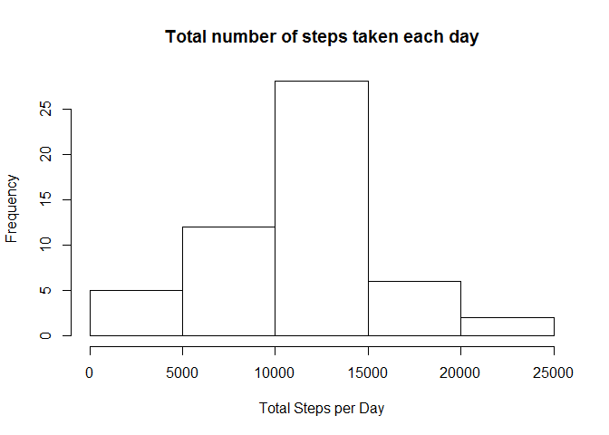
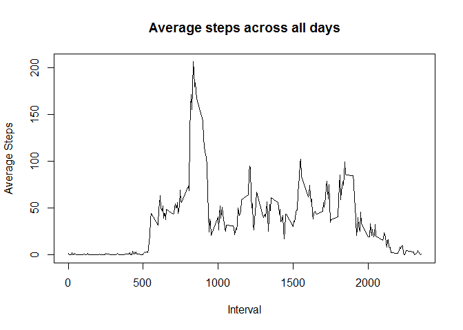
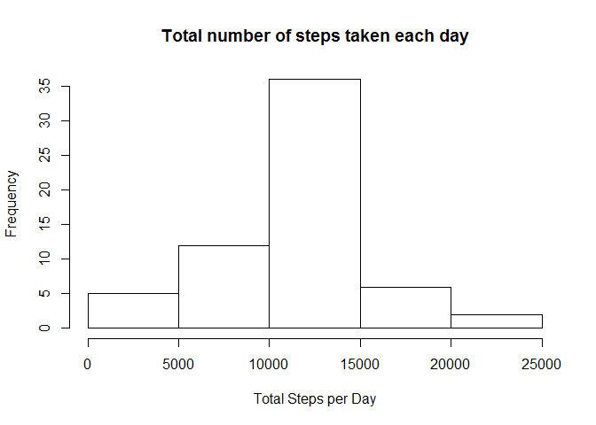
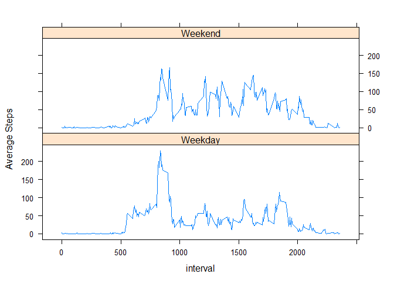

# PA1_template


##Loading and preprocessing the data

```r
rowdata<-read.csv("data/activity.csv", header = TRUE, sep = ",")
activity<-rowdata[!is.na(rowdata$steps),]
activity$date<-as.Date(as.character(activity$date),"%Y-%m-%d")
```


  
##What is mean total number of steps taken per day?
1. Calculate the total number of steps taken per day

```r
library("plyr")
TotalPerDay<-ddply(activity, .(date), summarize, sum=sum(steps))
```


2. Make a histogram of the total number of steps taken each day

```r
hist(TotalPerDay$sum, main="Total number of steps taken each day", 
     xlab="Total Steps per Day")
```

 


3. Calculate the mean and median of the total number of steps taken per day

```r
mean(TotalPerDay$sum)
```

```
## [1] 10766.19
```

```r
median(TotalPerDay$sum)
```

```
## [1] 10765
```


##What is the average daily activity pattern?
1. Make a time series plot of the 5-minute interval (x-axis) and the average number of steps taken, averaged across all days (y-axis)

```r
TotalPerInterval<-ddply(activity, .(interval), summarize, average=mean(steps))
plot(TotalPerInterval$interval, TotalPerInterval$average, type="l", 
     xlab="Interval", ylab="Average Steps", 
     main="Average steps across all days")
```

 


2. Which 5-minute interval, on average across all the days in the dataset, contains the maximum number of steps?

```r
TotalPerInterval[which(TotalPerInterval$average==max(TotalPerInterval$average)),1]
```

```
## [1] 835
```


##Imputing missing values
1. Calculate and report the total number of missing values in the dataset 

```r
sum(is.na(rowdata$steps))
```

```
## [1] 2304
```


2. Devise a strategy for filling in all of the missing values in the dataset. The strategy will use the mean for that 5-minute interval.

```r
fulldata<-join(rowdata, TotalPerInterval, by="interval")
missrow<-which(is.na(fulldata$steps))
fulldata[missrow,1]<-fulldata[missrow,4]
fulldata$date<-as.Date(as.character(fulldata$date),"%Y-%m-%d")
```


3. Calculate the total number of steps taken per day

```r
TotalPerDay_full<-ddply(fulldata, .(date), summarize, sum=sum(steps))
```


4. Make a histogram of the total number of steps taken each day

```r
hist(TotalPerDay_full$sum, main="Total number of steps taken each day", 
     xlab="Total Steps per Day")
```

 


   Calculate the mean and median of the total number of steps taken per day

```r
mean(TotalPerDay_full$sum)
```

```
## [1] 10766.19
```

```r
median(TotalPerDay_full$sum)
```

```
## [1] 10766.19
```


##Are there differences in activity patterns between weekdays and weekends?
1. Create a new factor variable in the dataset with two levels - "weekday" and "weekend" indicating whether a given date is a weekday or weekend day.

```r
library("dplyr")
fulldata<-mutate(fulldata, 
                 dayofweek=factor(1*(weekdays(fulldata$date)=="Sunday" 
                                 | weekdays(fulldata$date)=="Saturday"), 
                              labels=c("Weekday","Weekend")))
```


2. Make a panel plot containing a time series plot of the 5-minute interval (x-axis) and the average number of steps taken, averaged across all weekday days or weekend days (y-axis). 

```r
TotalPerInterval_full<-ddply(fulldata, .(dayofweek, interval), summarize,
                             average=mean(steps))
library("lattice")
xyplot(average~interval | dayofweek, data=TotalPerInterval_full, layout=c(1,2),
       type="l", ylab="Average Steps")
```

 
